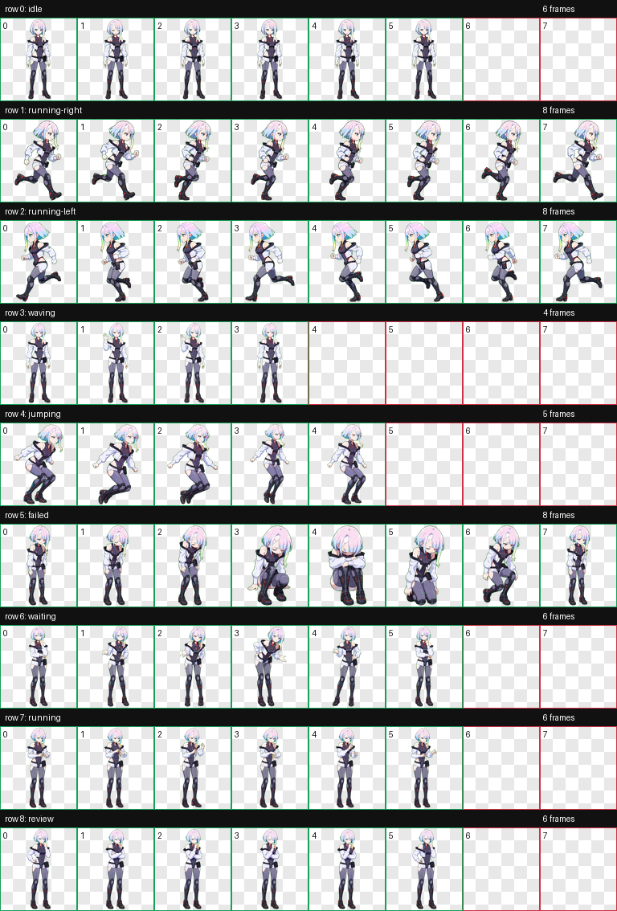
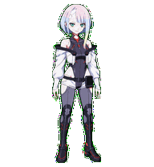

# Cyberpunk Edgerunners Lucy Codex Pet

An animated Codex pet inspired by Lucy's cyberpunk outfit design.

The package includes a transparent animated spritesheet and `pet.json` metadata for Codex-compatible pet loading.

## Direct Download

Download the ready-to-use package:

[dist/lucy-codex-pet.zip](dist/lucy-codex-pet.zip)

After downloading, unzip it. The archive contains a `lucy` folder with:

- `pet.json`
- `spritesheet.webp`

Use that unzipped `lucy` folder as the pet package.

## Direct Download

Download the ready-to-use package:

[dist/lucy-codex-pet.zip](dist/lucy-codex-pet.zip)

After downloading, unzip it. The archive contains a `lucy` folder with:

- `pet.json`
- `spritesheet.webp`

Use that unzipped `lucy` folder as the pet package.

## Preview

## Included Files

- `pets/lucy/pet.json` - pet metadata
- `pets/lucy/spritesheet.webp` - final animated spritesheet
- `docs/contact-sheet.png` - QA contact sheet showing all animation rows
- `docs/previews/idle.gif` - sample animation preview
- `dist/lucy-codex-pet.zip` - direct download package

## Animation Rows

The spritesheet uses a fixed 8 column x 9 row layout:

| Row | State |
|---:|---|
| 0 | idle |
| 1 | running-right |
| 2 | running-left |
| 3 | waving |
| 4 | jumping |
| 5 | failed |
| 6 | waiting |
| 7 | running |
| 8 | review |

## Validation

The final spritesheet was validated at `1536 x 1872` pixels with transparent unused cells and no validation errors.

## Notes

This is fan-made character artwork packaged as a Codex pet. It is intended for personal and portfolio use.
